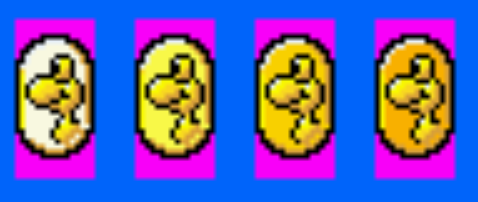
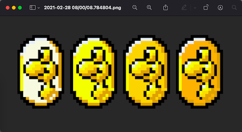
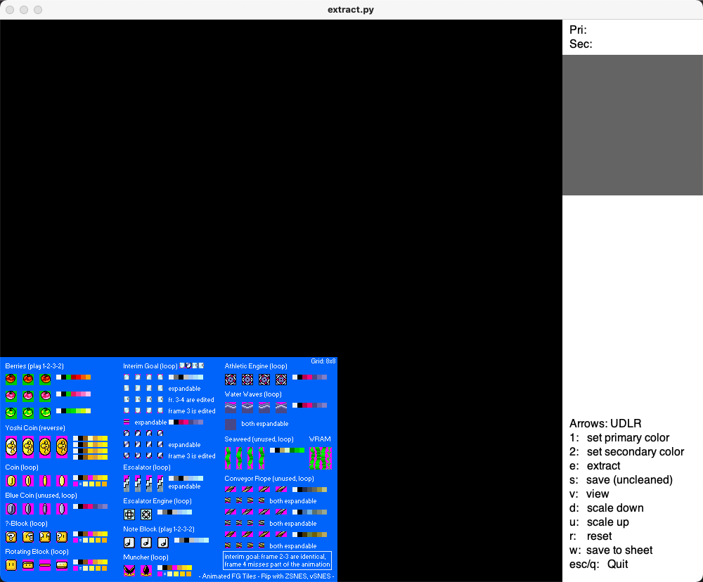
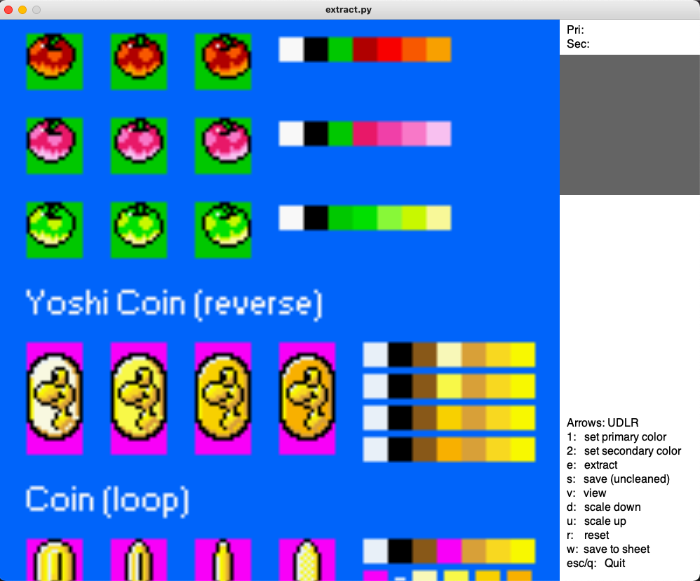
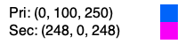
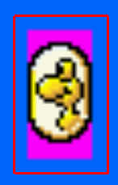
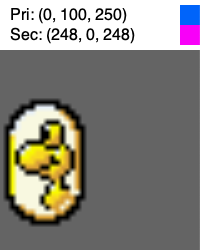
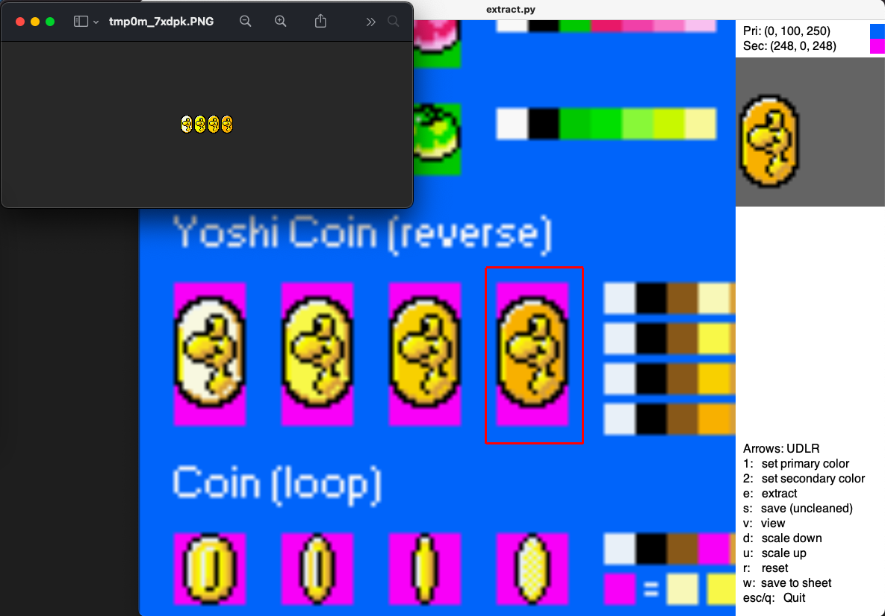
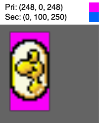

# Game Sprite Background Remover
A GUI tool to speed up sprite extraction by removing the surrounding colors from the sprites you want.  

### Basic Operation
Don't forget to start your virtual environment and install from `requirements.txt` using pip.  
This program was made using python 3.9 on macOS Big Sur.  

1. Start up your virtual environment and download packages with pip:
```bash
python3 -m venv venv
source venv/bin/activate
pip3 install -r requirements.txt
```
2. Run: `./start <spritesheet.png>`
3. Zoom and pan to your target sprite.
4. Set your Primary and Secondary colors.
5. Outline the sprite you want.
6. Extract and see the result in the preview pane.
7. Save all of them to a single spritesheet.

### Example Operation
Here is an example of extracting these yoshi coins from a sprite sheet and the result.  
   

1. Start the program and load the sprite sheet you will extract from.  
    * `./start resources/Coins.png`  



2. Zoom and pan to the sprite you want to extract using arrow keys and "u" or "d".  



3. Identify the primary and secondary colors by putting the crosshairs over the color and pressing "1" or "2".  



4. Outline the sprite by clicking and dragging from one corner to the opposite corner.  



5. Extract and preview the sprite by pressing "e" (extract), "v" (view) then "s" (save).  



6. When finished with all the sprites you want, save them to their own sprite sheet by pressing "w" (write all sprites to a single sheet).  



### Other Uses
You can reverse the primary and secondary colors to keep the secondary.  




### Notes
* Extract one sprite image at a time, but save all of them at once.
* A 1-pixel clear border is added around each sprite's frame to prevent image bleeding in pyglet.
* After extracting all the images you want then save all to a sprite sheet.
* Program assumes there is a primary and secondary color.
* Will preview sprites up to 200 x 200 pixels. Larger images overflow the window
